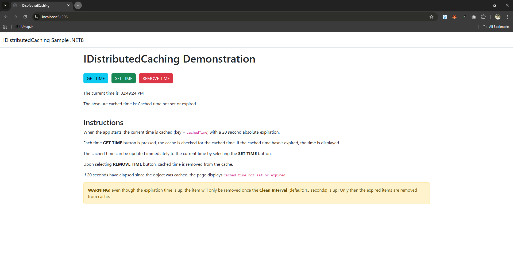

# IDISTRIBUTED CACHING SAMPLE

## Table of Contents

* [Introduction](#introduction)
* [Prerequisites](#prerequisites)
* [Build and Run the Sample](#build-and-run-the-sample)
* [Troubleshooting](#troubleshooting)
* [References](#references)
* [Additional Resources](#additional-resources)
* [Technical Support](#technical-support)
* [Copyrights](#copyrights)

## Introduction

This sample is a .NET 8.0 MVC web application that demonstrates how to use NCache as a distributed cache provider through the `IDistributedCache` interface. It showcases basic caching operations, including absolute expirations, manual cache updates, and removal of cached data. NCache is registered as the provider for `IDistributedCache` using settings from `appsettings.json`.

The Home page displays a simple interface with buttons, current and cached time and instructions along with a warning. The working of the webpage and buttons is as follows:
- On page load: Retrieves the cached time from NCache using `IDistributedCache.GetAsync`
  - If the cached value exists, time is decoded and displayed on the page.
  - Otherwise "Cached time not set or expired" is displayed.
- `GET TIME`: Refreshes the page.
- `SET TIME`: Current time is stored in NCache using `IDistributedCache.SetAsync` with a 20-second absolute expiration and the page is refreshed.
- `REMOVE TIME`: Cached time is removed and the page is refreshed.



## Prerequisites

Before running the sample, ensure that:

- .NET 8.0 SDK and Visual Studio (recommended) are installed.
- NCache is installed and running in an accessible location.
  - If not, visit the following link to get started:\
  https://www.alachisoft.com/resources/docs/ncache/getting-started/
- Ensure that `demoCache` (or another cache of your choice) is running.
  - This is created during installation, otherwise you can create a new cache via this link:\
  https://www.alachisoft.com/resources/docs/ncache/admin-guide/create-new-distributed-cache.html
- NuGet package required (The package references are already included in the project file).
	- `Alachisoft.NCache.OpenSource.SDK`
	- `NCache.Microsoft.Extensions.Caching.Opensource`

## Build and Run the Sample

Before building this sample, if you need to change the cache name, open `appsettings.json` from the project root directory and change the `CacheName` value:

```json
{
  "NCacheSettings": {
    "CacheName": "demoCache",
    "EnableLogs": false,
    "EnableDetailLogs": false,
    "ExceptionsEnabled": false,
    "OperationRetry": 0,
    "operationRetryInterval": 0
  }
}
```

From Visual Studio (Recommended):
- Open `IDistributedCaching.sln`.
- Let NuGet packages restore.
- Build and run.

From command line (optional):
```bash
# Replace <path-to-sample> with the sample location on your machine,
# e.g. d:\ncache-samples\IDistributedCaching
cd "<path-to-sample>"
dotnet restore
dotnet build
dotnet run
```

## Troubleshooting

### NuGet Packages Are Not Restored

- If NuGet packages are not restored properly:
	- **Visual Studio**: Right‑click the solution → Restore NuGet Packages.
	- **Command line**: Run `dotnet restore` in the sample folder, (see [Build and Run](#build-and-run-the-sample) section).
	- **nuget.exe**: Run `nuget restore IDistributedCaching.sln`.	

## References

For more information about IDistributedCache, see:\
https://www.alachisoft.com/resources/docs/ncache/prog-guide/using-idistributedcache-api.html

## Additional Resources

### Samples & Playground

For more samples of NCache features on various platforms:\
https://github.com/Alachisoft/NCache-Samples/

You can also visit NCache Playground for an interactive feature demo:\
https://www.alachisoft.com/nclive/

### Documentation

The complete online documentation for NCache is available at:\
https://www.alachisoft.com/resources/docs/

### Developer's Guide

The complete developer's guide of NCache is available at:\
https://www.alachisoft.com/resources/docs/ncache/prog-guide/

## Technical Support

Alachisoft&copy; provides various sources of technical support. 

- Please refer to https://www.alachisoft.com/support.html to select a support resource you find suitable for your issue.
- To request additional features in the future, or if you notice any discrepancy regarding this document, please drop an email to [support@alachisoft.com](mailto:support@alachisoft.com).

## Copyrights

Copyright 2026 Alachisoft&copy;