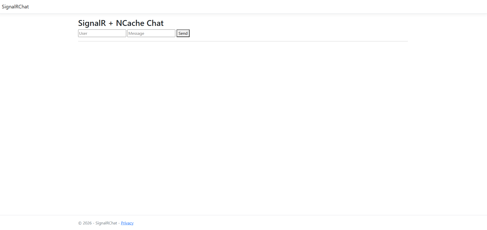

# SIGNALR CHAT SAMPLE

## Table of Contents

* [Introduction](#introduction)
* [Prerequisites](#prerequisites)
* [Build and Run the Sample](#build-and-run-the-sample)
* [Troubleshooting](#troubleshooting)
* [References](#references)
* [Additional Resources](#additional-resources)
* [Technical Support](#technical-support)
* [Copyrights](#copyrights)

## Introduction

This sample is a .NET 8.0 MVC application that demonstrates how to integrate ASP.NET SignalR with NCache to build a scalable, real-time chat system. SignalR enables real-time communication between the server and connected clients, while NCache acts as a distributed backplane to ensure that messages are delivered instantly to all the connected clients. NCache is registered as the SignalR backplane using the `AddSignalR().AddNCache()` configuration.

The Home Page displays a simple chat page with Username and Message input fields, along with a Send button for submitting messages. The sample works as follows:
- When the application starts, the chat page loads and establishes a SignalR connection with the server.
- Opening the same URL in another browser tab creates another independent user connected to the same chat.
- A user enters their username and message, then clicks Send.
	- The message is sent to the SignalR hub.
	- The hub broadcasts the message to all connected clients in real time.

On starting the single page web application, the index page displays the heading along with textboxes where Username and Message, respectively, can be written. Next to them is a `Send` button to deliver the message to other users.



## Prerequisites

Before running the sample, ensure that:

- .NET 8.0 SDK and Visual Studio (recommended) are installed.
- NCache is installed and running in an accessible location.
  - If not, visit the following link to get started:\
  https://www.alachisoft.com/resources/docs/ncache/getting-started/
- Ensure that `demoCache` (or another cache of your choice) is running.
  - This is created during installation, otherwise you can create a new cache via this link:\
  https://www.alachisoft.com/resources/docs/ncache/admin-guide/create-new-distributed-cache.html
- Ensure SignalR applications use `SignalRChatApp` as the event key.
	- By default, the event key `SignalRChatApp` is configured in `appsettings.json`. Adjust as needed.
- NuGet packages required (references already included in the project):
	- `Alachisoft.NCache.SDK`
	- `AspNetCore.SignalR.NCache`

## Build and Run the Sample

Before building this sample, if you need to change the cache name and event key, open `appsettings.json` from the project root directory and change the `CacheName` and `EventKey` values:

```json
{
  "NCacheConfiguration": {
    "CacheName": "demoCache",
    "EventKey": "SignalRChatApp"
	}
}
```

From Visual Studio (Recommended):
- Open `SignalRChat.sln`.
- Let NuGet packages restore.
- Build and run.

From command line (optional):
```bash
# Replace <path-to-sample> with the sample location on your machine,
# e.g. d:\ncache-samples\SignalRChat
cd "<path-to-sample>"
dotnet restore
dotnet build
dotnet run
```

## Troubleshooting

### NuGet Packages Are Not Restored

- If NuGet packages are not restored properly:
	- **Visual Studio**: Right‑click the solution → Restore NuGet Packages.
	- **Command line**: Run `dotnet restore` in the sample folder, (see Build and Run section).
	- **nuget.exe**: Run `nuget restore SignalRChat.sln`.

## References

For more information about SignalR, see:\
https://www.alachisoft.com/resources/docs/ncache/prog-guide/ncache-extension-signalr-core.html

## Additional Resources

### Samples & Playground

For more samples of NCache features on various platforms:\
https://github.com/Alachisoft/NCache-Samples/

You can also visit NCache Playground for an interactive feature demo:\
https://www.alachisoft.com/nclive/

### Documentation

The complete online documentation for NCache is available at:\
https://www.alachisoft.com/resources/docs/

### Developer's Guide

The complete developer's guide of NCache is available at:\
https://www.alachisoft.com/resources/docs/ncache/prog-guide/

## Technical Support

Alachisoft&copy; provides various sources of technical support. 

- Please refer to https://www.alachisoft.com/support.html to select a support resource you find suitable for your issue.
- To request additional features in the future, or if you notice any discrepancy regarding this document, please drop an email to [support@alachisoft.com](mailto:support@alachisoft.com).

## Copyrights

Copyright 2026 Alachisoft&copy;